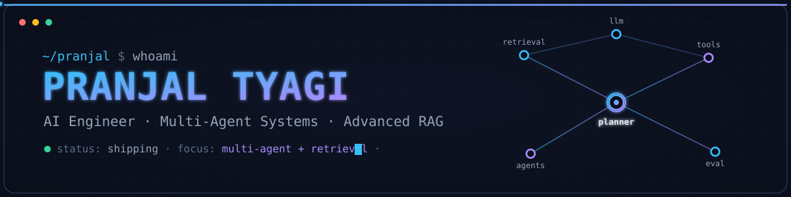

<!--
  ════════════════════════════════════════════════════════════════════
  PRANJAL TYAGI · GitHub Profile README · v2 (animated)
  Theme: Terminal / Systems · Accent: cyan→violet · BG: slate-navy (#0A0E1A)
  ─────────────────────────────────────────────────────────────────────
  Animated layers:
   1. assets/banner.svg        → live SVG (pulsing agent nodes, data flow, cursor)
   2. Typing SVG               → animated roles
   3. Repo pin cards           → live stars/forks per project
   4. 3D contribution graph    → generated by .github/workflows/3d-contrib.yml
   5. Contribution snake       → generated by .github/workflows/snake.yml
   6. Activity graph + streak  → live services
   7. Trophies + waving gradient footer
  NOTE: layers 4 & 5 appear after their workflows run once
        (Actions tab → run each workflow manually the first time).
  ════════════════════════════════════════════════════════════════════
-->

<!-- ░░░ HERO BANNER (animated SVG) ░░░ -->

  

 

<!-- ░░░ TYPING EFFECT ░░░ -->

  

<!-- ░░░ SOCIAL LINKS ░░░ -->

  
  
  
  

 

---

## ` 01 ` Who I Am

I'm an **AI Engineer** focused on shipping systems that hold up outside a notebook — where retrieval quality, agent coordination, evaluation, and latency actually matter. I build applications in which **multiple agents collaborate, retrieve knowledge, reason, call tools, and make autonomous decisions**, and I care as much about the API contract and the eval harness as I do about the model.

My work sits at the intersection of **LLMs, agentic orchestration, advanced RAG, and clean backend engineering**. I default to designing for production: typed interfaces, reproducible pipelines, measurable behavior.

 

<table>
  <tr>
    <td width="50%" valign="top">
      <h3>&nbsp;⌁&nbsp; Current Focus</h3>
      <ul>
        <li>Multi-agent systems that plan, delegate, and self-correct</li>
        <li>Reflection &amp; self-improving RAG pipelines</li>
        <li>Tool-using autonomous agents with human-in-the-loop gates</li>
        <li>Evaluation harnesses for LLM output quality</li>
      </ul>
    </td>
    <td width="50%" valign="top">
      <h3>&nbsp;⌁&nbsp; How I Work</h3>
      <ul>
        <li>Production mindset over one-off demos</li>
        <li>Design the interface before the implementation</li>
        <li>Measure behavior, don't assume it</li>
        <li>Documentation is part of the deliverable</li>
      </ul>
    </td>
  </tr>
</table>

---

## ` 02 ` Featured Work

<!-- Live repo pin cards: show stars / forks / primary language automatically.
     Each card is clickable and links to the repository. -->

 

<b>&nbsp;⬡ Project details — what each system actually does</b>

 

**Reflection-Augmented RAG** — A retrieval pipeline that critiques and improves its own answers. A reflection layer scores retrieved context and generated responses, then re-queries or refines until the answer clears a quality bar.
 `Advanced RAG` · `Reflection loop` · `Retrieval evaluation` · `Self-improving responses`

**Autonomous Data Science Advisor** — A multi-agent system that runs an ML workflow end to end: cleaning data, engineering features, selecting models, and explaining its decisions.
 `Multi-agent` · `AutoML workflow` · `Data cleaning` · `Feature engineering` · `Model selection` · `Explainability`

**AI Travel Company** — A LangGraph multi-agent workflow that plans complete trips: dedicated agents handle flights, hotels, budget, weather, and visa checks, coordinated by a planner with human approval before anything is finalized.
 `LangGraph` · `Flights` · `Hotels` · `Budget` · `Weather` · `Visa` · `Human approval`

**ClaimGuard AI** — A multimodal, multi-agent system for insurance claims: vision models inspect submitted evidence while reasoning agents assess risk and flag inconsistencies.
 `Multimodal AI` · `Vision AI` · `Risk analysis` · `Multi-agent architecture`

**Portfolio Website** — Fast, responsive personal site with modern UI. **[Live →](https://pranjal-ai-portfolio.vercel.app/)**
 `Next.js` · `Tailwind CSS` · `Responsive`

---

## ` 03 ` AI Expertise

| 🧠 LLM Engineering | 🕸️ Agentic AI | 🔎 Advanced RAG | 📐 AI System Design |
|:--:|:--:|:--:|:--:|
| Prompt Engineering | Multi-Agent Systems | Reflection RAG | Evaluation & Reliability |

---

## ` 04 ` Technical Skills

**Languages**

**AI / ML**

`LLMs` · `Agentic AI` · `RAG` · `LangChain` · `LangGraph` · `Prompt Engineering` · `Embeddings`

**Machine Learning**

`XGBoost` · `Pandas` · `NumPy` · `Matplotlib`

**Backend**

**Databases**

**DevOps & Cloud**

---

## ` 05 ` GitHub Analytics

  

  

<!-- ░░░ 3D CONTRIBUTION GRAPH ░░░
     Generated daily by .github/workflows/3d-contrib.yml
     ▶ First time: Actions tab → "3D contribution graph" → Run workflow -->

  

  

<!-- ░░░ CONTRIBUTION SNAKE (animated) ░░░
     Generated daily by .github/workflows/snake.yml
     ▶ First time: Actions tab → "Contribution snake" → Run workflow -->

  

---

## ` 06 ` Achievements

  

---

## ` 07 ` Certifications & Experience

<table>
  <tr>
    <td width="60%" valign="top">
      <h3>Certifications</h3>
      <ul>
        <li><b>Google Cloud</b> — Generative AI</li>
        <li><b>Hugging Face</b> — AI Agents</li>
        <li><b>Kaggle</b> — Machine Learning</li>
      </ul>
    </td>
    <td width="40%" valign="top">
      <h3>Experience</h3>
      <ul>
        <li><b>Betalab AI Club</b> Sub Lead</li>
      </ul>
    </td>
  </tr>
</table>

---

## ` 08 ` Engineering Principles

> **Design the contract first.** A clean interface makes the implementation replaceable.
>
> **Evaluate, don't trust.** If an LLM's output matters, there's a harness measuring it.
>
> **Autonomy with guardrails.** Agents should act — and know when to stop and ask.

---

<!-- ░░░ FOOTER ░░░ -->

### Let's build something that ships.

  
<code>status: shipping · focus: multi-agent + retrieval · open to opportunities</code>

<!-- animated gradient wave footer -->

